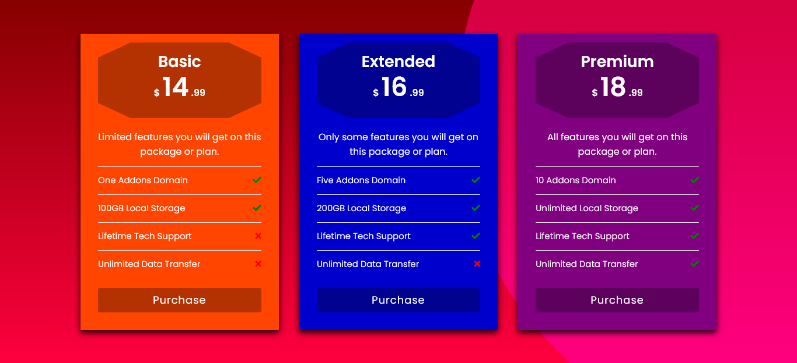

<h1>Pricing Table</h1>

<h2>A table for prices using HTML and CSS.</h2>

This project is created using a bit of flexbox and position property. I created this following the tutorial of CodingLab. I've changed the color scheme and updated the values of measures from px to rem and em. This project was fun to create and to learn how to build a simple pricing table.

### Link

- Live Site: [Pricing Table](https://leslielopez25.github.io/Responsive-Pricing-Table/)

### Screenshot

